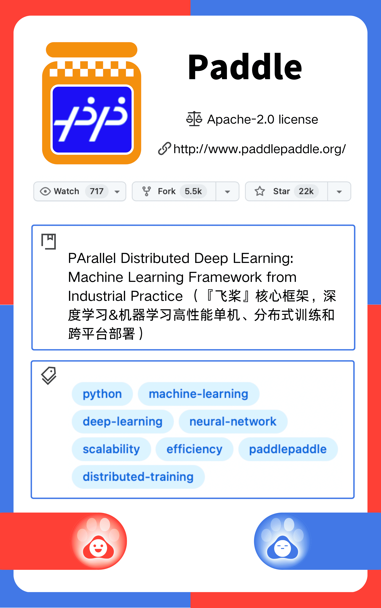
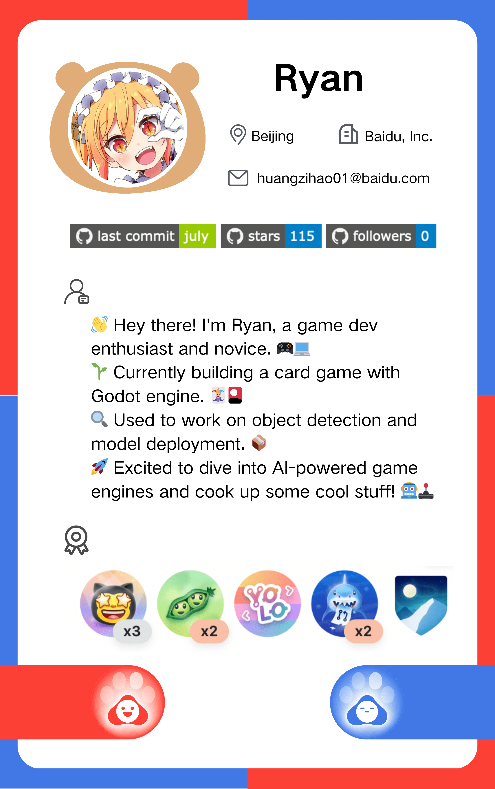

<!-- English | [简体中文](./README_cn.md) -->

<div align="center">
<!-- 标题 -->

<h1 align="center">
  - CodeMate Bear - 
</h1>

<!-- star数, fork数, pulls数, issues数, contributors数, 开源协议 -->

<a href="https://github.com/DrRyanHuang/CodeMateBear/stargazers"></a>
<a href="https://github.com/DrRyanHuang/CodeMateBear/network/members"></a>
<br/>
<a href="https://github.com/DrRyanHuang/CodeMateBear/pulls"></a>
<a href="https://github.com/DrRyanHuang/CodeMateBear/issues"></a>
<a href="https://github.com/DrRyanHuang/CodeMateBear/graphs/contributors"></a>
<a href="https://github.com/DrRyanHuang/CodeMateBear/blob/master/LICENSE"></a>

<!-- logo -->

 </img>
<br/>
<i>Loved the project? Please consider forking the project to help it improve!</i>🌟

</div>


This project leverages the ERNIE Bot to implement a recommendation system. 🤖 It crawls GitHub user and repository information, feeds it into the large language model, and allows the model to extract relevant keywords. 🔍 Based on these keywords, it searches for projects on GitHub and recommends them to users in the order of the most stars, most forks, and best matches. 🌟🍴


### Demo Showcase 🎥🌟

<div align="center">
   </img>
   </img>
   </img>
   </img>
</div>


### How to run 🚀

Add your AISTUDIO [**accessToken**](https://aistudio.baidu.com/account/accessToken) to `token.txt` 

```
python3 -mpip install -r requirements.txt
python3 main.py
```

- `utils.py` contains a collection of small utility functions. 🛠️
- `github_api.py` contains classes and functions for scraping GitHub information. 🕷️
- `test_agently.py` 和 `test_github_api.py` are test scripts, with the former testing `Agently` and the latter verifying the accuracy of GitHub information scraping. ✅


### TO DO LIST ⏰

- [x] GitHub information crawling
- [x] GitHub search behavior simulation
- [x] GitHub user information analysis
- [x] GitHub repository analysis
- [x] Support AISTUDIO accessToken
- [x] Support Qianfan accessToken
- [ ] Add offline database
- [ ] Analyze user-starred repositories
